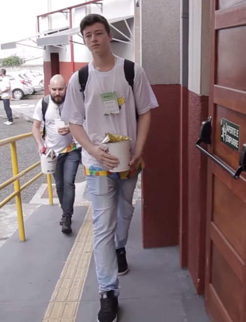

## About Me

HI! I am a indepent Security Researcher Jr, i have more than 3 years experience
with Perl and Shell Script.

## Research Interest

I am fascinated by the hacker lifestyle and i also love everything that is connected to 
electrical outlet and that's why try to hack everything!

In my [Github](https://github.com/GouveaHeitor) you can see some of the code i write during my searches.

## Publications

1. [Nipe: a script to make Tor Network your default gateway. ](https://medium.com/@gouveaheitor/nipe-script-to-redirect-all-traffic-from-the-machine-to-the-tor-network-5f01a083fc80#.cj4jh239rNipe is a script to make Tor Network your default gateway. )